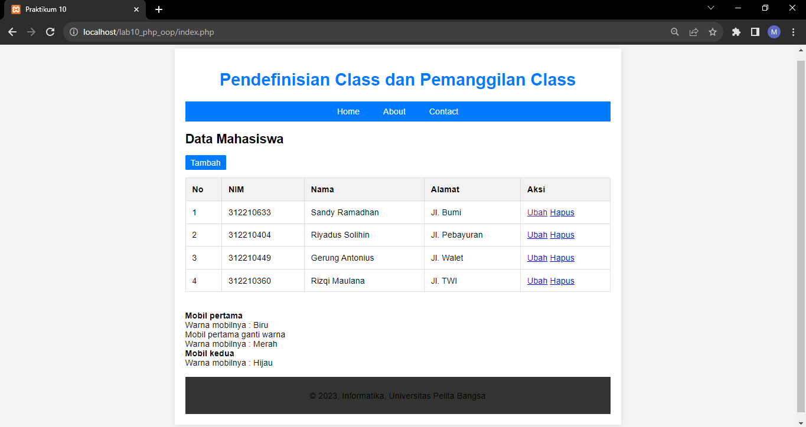
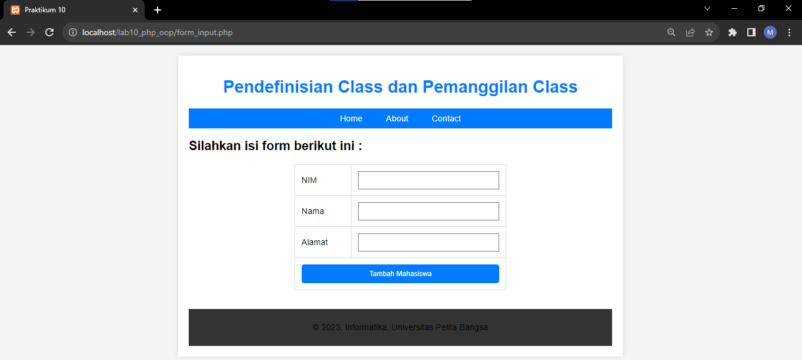

# Lab10Web

|  |  |  |
|-----|------|-----|
|Nama|Muhammad Rizqi Maulana|
|NIM|312210360|
|Kelas|TI.22.A.4|
|Mata Kuliah|Pemograman Web|

## **Pertanyaan dan Tugas**
Implementasikan konsep modularisasi pada kode program pada praktikum sebelumnya dengan menggunakan class library untuk **form** dan **database connection**.

- **Membuat file config.php**

    ```php
    <?php

    return [
        'host' => 'localhost',
        'username' => 'root',
        'password' => '',
        'mobildb' => 'mobildb',
    ];

    ?>
    ```
    File `config.php` ini berfungsi untuk menyimpan konfigurasi yang diperlukan oleh aplikasi, terutama informasi koneksi ke database. Dengan menggunakan file konfigurasi seperti ini, Anda dapat dengan mudah mengelola dan mengubah informasi koneksi atau konfigurasi lainnya tanpa harus menyunting langsung file kode program yang menggunakannya.

    Pada kasus ini, file `config.php` menyimpan informasi berikut:

    - `'host' => 'localhost'`: Menyimpan host database (biasanya 'localhost' jika database berada di server yang sama dengan aplikasi).
    - `'username' => 'root'`: Menyimpan nama pengguna untuk koneksi database.
    - `'password' => ''`: Menyimpan kata sandi untuk koneksi database.
    - `'mobildb' => 'mobildb'`: Menyimpan nama database yang akan digunakan.

    Dengan menyimpan informasi ini di file terpisah, Anda dapat dengan mudah memperbarui atau mengganti konfigurasi database tanpa harus menyunting langsung file-file yang menggunakannya. Ini mempermudah pemeliharaan dan konfigurasi aplikasi secara keseluruhan.
- **Menghapus file koneksi.php**

    File koneksi.php tidak dibutuhkan karena fungsionalitas koneksi telah dimasukkan langsung ke dalam class Database di file database.php. Oleh karena itu, semua logika koneksi dan method yang terkait dengannya disatukan dalam satu class.

    Di dalam class Database, metode __construct memanggil metode connect, yang menginisialisasi koneksi database menggunakan informasi yang diperoleh dari file config.php. Dengan struktur ini, Anda dapat membuat objek $db menggunakan new Database(), dan koneksi database akan dibuat secara otomatis.

    Jadi, pada dasarnya, file koneksi.php tidak diperlukan lagi karena logika koneksi telah disatukan dalam class Database. Namun, pastikan bahwa file config.php masih berisi informasi koneksi database yang sesuai.

## Hasil

<br>
<br>

<br>